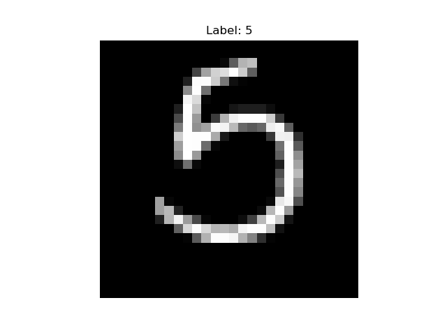

# ANN Class

Coursework and lab exercises for the Artificial Neural Networks (ANN) class.
Each lab builds part of a neural-network modeling pipeline using PyTorch.

## Setup

The labs use a Conda environment named `env-ann`.

```bash
# Create the environment from the spec
conda env create -f lab1/environment.yml

# Activate it
conda activate env-ann

# Launch Jupyter
jupyter notebook
```

> Running in Google Colab? The instruction notebooks include an optional cell to
> mount Google Drive and run the imports there instead.

## Labs

### Lab 1 — Loading and Preparing Image Data

Load, transform, and visualize the MNIST handwritten-digit dataset: build
augmentation/normalization pipelines, split into train/validation/test, and
serve mini-batches with `DataLoader`.
Open `lab1/lab1_instruction.ipynb` to get started.

Sample output from the data pipeline:



### Lab 2 — LSTM Time Series Forecasting

Airline passenger forecasting with an LSTM, trained for 150 epochs.

**Result:** Test RMSE of 27.61 thousand passengers.

### Lab 3 — CNN Image Classification on CIFAR-10

Convolutional network trained for 10 epochs on CIFAR-10.

**Result:** 76.20% test accuracy (76.70% validation accuracy at final epoch).
